# 📱 Unveil - Prueba Técnica Mobile

Este proyecto fue desarrollado como parte de la prueba técnica para el puesto de **Desarrollador Mobile** en Unveil. La app permite a influencers registrarse, definir sus intereses, visualizar campañas disponibles y generar su currículum virtual.

---

## 🧰 Tecnologías & Versiones Clave

| Tecnología             | Versión    |
| ---------------------- | ---------- |
| Node.js                | `^18.x`    |
| React Native           | `0.76.9`   |
| Expo                   | `~52.0.46` |
| React                  | `18.3.1`   |
| Zustand (global state) | `^5.0.3`   |
| React Navigation       | `^7.1.6`   |
| React Hook Form        | `^7.55.0`  |
| Styled Components      | `^6.1.17`  |
| Zod (validaciones)     | `^3.24.2`  |

> ⚠️ Este proyecto requiere Node.js **versión 18.x** (no compatible con 19+)

---

## 🚀 Instalación y ejecución

### 1. Clonar el proyecto

```bash
git clone https://github.com/alexk8uu/unveil.git
cd unveil
```

### 2. Instalar dependencias

Usando **Yarn** (recomendado):

```bash
yarn install
```

> También podrías usar si preferís npm, pero se sugiere Yarn para compatibilidad total.

```bash
npm install --legacy-peer-deps
```

### 3. Levantar el proyecto

```bash
yarn start
```

# o

````bash
npm run start
```


O bien:

```bash
yarn android     # Dispositivo Android
yarn ios         # Simulador iOS
yarn web         # Vista web (limitada)
````

# o

```bash
npm run android
npm run ios
npm run web
```

### 4. Probar en un dispositivo físico

Para probar en un dispositivo físico, escanea el código QR que aparece en la terminal o en la app Expo Go.

> ⚠️ Asegúrate de que tu dispositivo y tu computadora estén en la misma red Wi-Fi.
> ⚠️ Si usas un simulador, asegúrate de que esté abierto antes de ejecutar el comando.
> ⚠️ Si usas un dispositivo Android, habilita la depuración USB.
> ⚠️ Si usas un dispositivo iOS, asegúrate de tener la app Expo Go instalada.
> ⚠️ Si usas un simulador iOS, asegúrate de tener Xcode instalado y configurado.
> ⚠️ Si usas un simulador Android, asegúrate de tener Android Studio instalado y configurado.

---

## 📁 Estructura del Proyecto

```bash
src/
├── app/                 # Navegación raíz
├── core/                # Validaciones, helpers, constantes
├── data/                # Mock data y almacenamiento local
├── domain/              # Modelos, enums y lógica de negocio
├── presentation/        # Pantallas y componentes visuales
│   ├── components/      # Componentes reutilizables
│   └── screens/         # Pantallas del flujo
│   └── navigations/     # Tipado y nombres de pantallas
├── store/               # Global state con Zustand
├── styles/              # Estilos globales compartidos
```

---

## ✨ Funcionalidades

- Onboarding en 4 pasos
- Intereses personalizados con badges
- Currículum virtual generado automáticamente
- Matching con campañas según intereses y nivel
- Persistencia local del usuario con `AsyncStorage`

---

## 🧪 Pruebas

> Aún sin tests automatizados, pero con potencial para:

- Validar lógica de filtrado de campañas
- Comprobar persistencia y recuperación de usuario
- Testear componentes como `StepBar`, badges de interés, etc.

---

## 📦 Buenas prácticas y arquitectura

- 🧱 **Clean Architecture**: Separación de capas (`data`, `domain`, `presentation`)
- 🧠 **MVVM Pattern**: La lógica se maneja desde el `store` y `core`, las vistas son declarativas
- 🌱 Estado global ligero y escalable con **Zustand**
- 📦 **Expo**: Simplifica el desarrollo y despliegue, ideal para MVPs

---

## 📸 Flujo de Pantallas (Capturas)

A continuación se presentan las principales pantallas de la app para entender su funcionamiento de punta a punta:

### 👋 Pantallas de bienvenida

**Bienvenida a usuario existente**  
 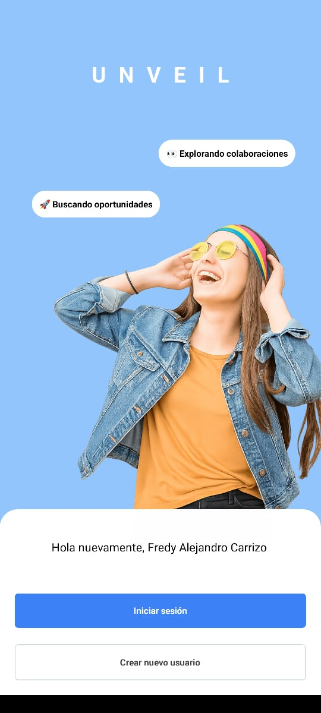

---

**Pantalla de login (ingresar contraseña)**  
 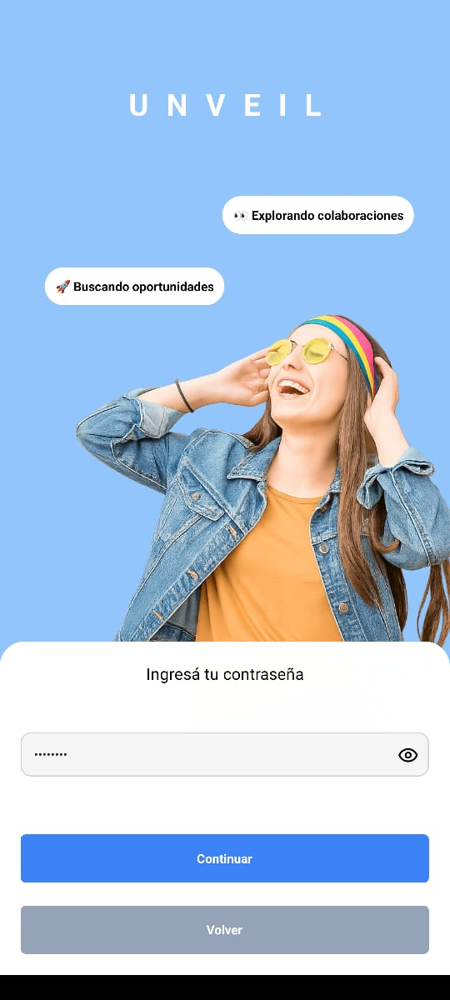

---

### 🔄 Onboarding (registro de nuevo usuario)

**Información personal**
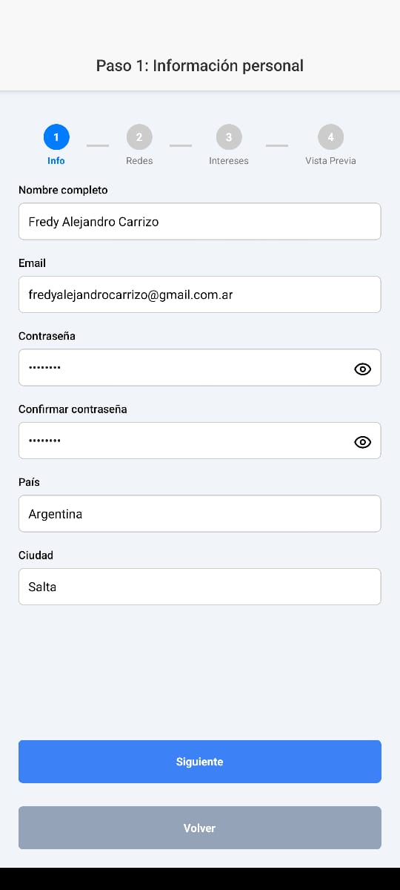

---

**Redes sociales**
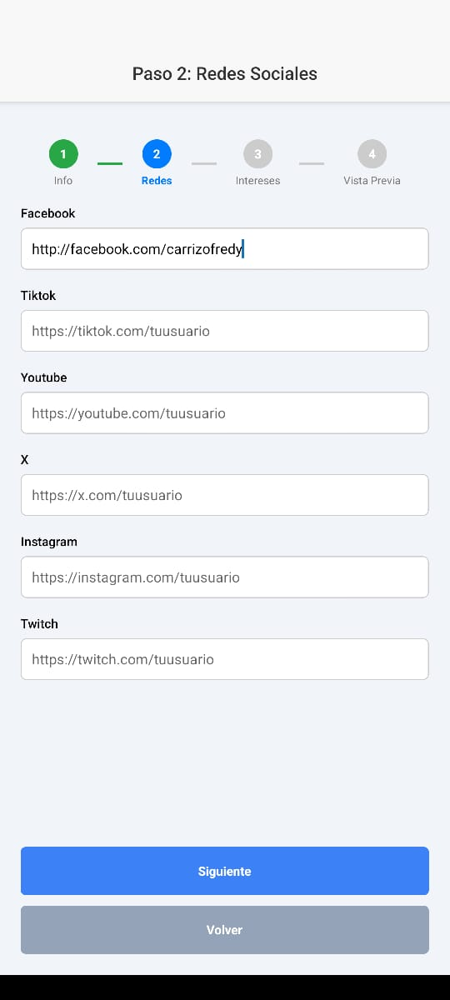

---

**Selección de intereses**
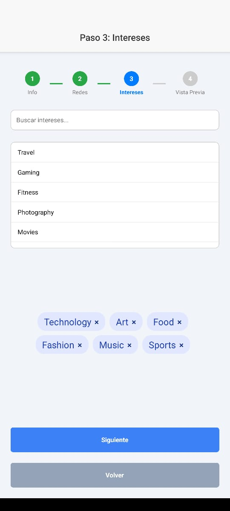

---

**Vista previa del currículum**  
 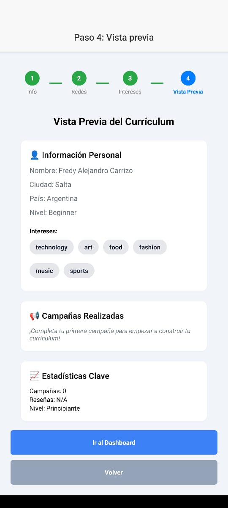

---

### 🧭 Dashboard y campañas

**Inicio y campañas recomendadas**  
 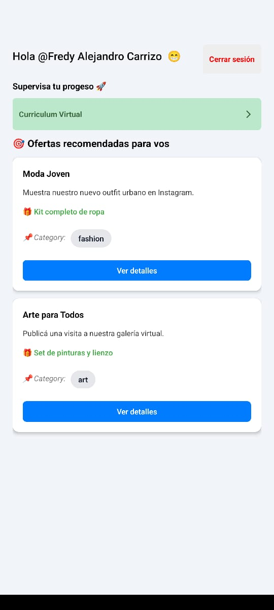

---

### 🎯 Proceso de postulación

**Detalle de una campaña vacía**  
 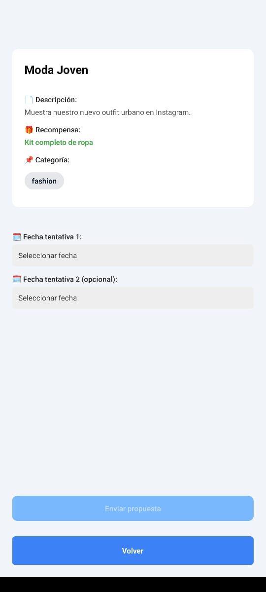

---

**Selector de fechas (modal)**  
 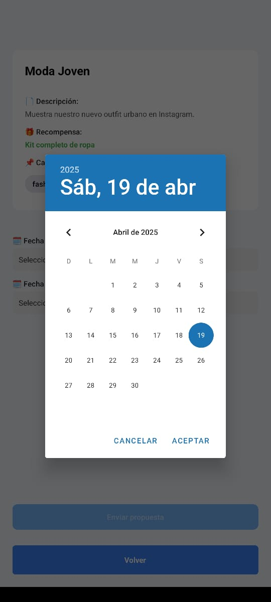

---

**Propuesta enviada (en revisión)**  
 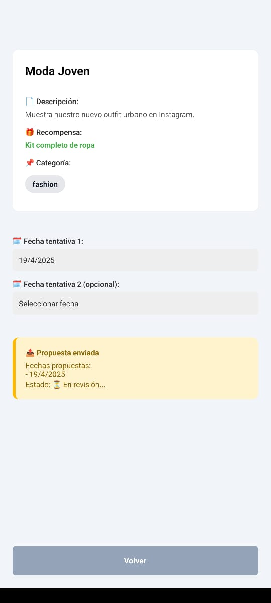

---

**Propuesta aceptada** ✅  
 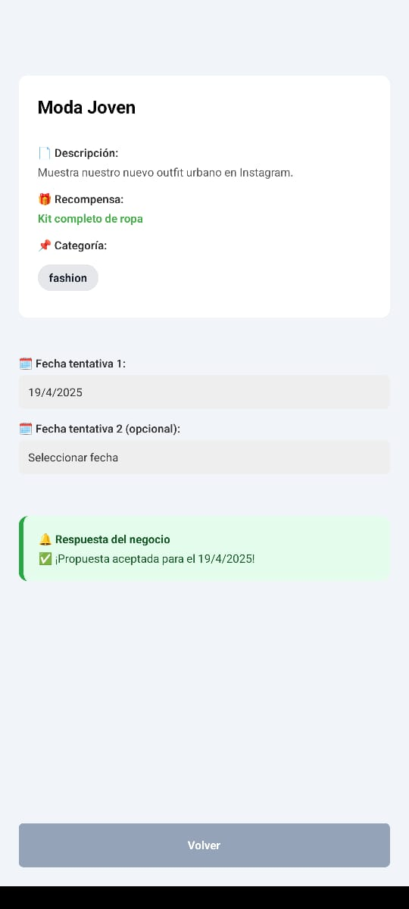

---

**Propuesta rechazada** ❌  
 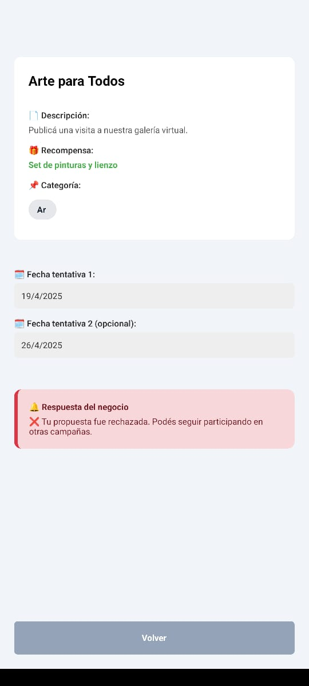

---

### 📄 Currículum actualizado

**Currículum actualizado**  
 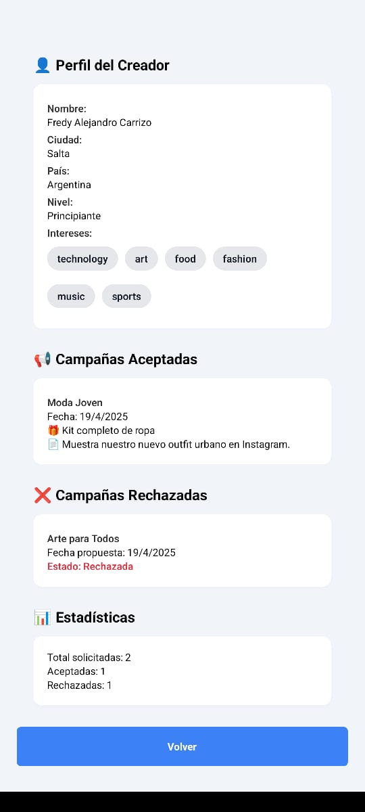

---

> Las capturas reflejan el flujo real de la app desarrollada con Expo y React Native.

## 📄 Licencia

Este proyecto fue desarrollado exclusivamente para fines de evaluación técnica.

---

## 👤 Autor

Fredy Alejandro Carizo  
📧 [fredyalejandrocarrizo@gmail.com](mailto:fredyalejandrocarrizo@gmail.com)  
💼 [LinkedIn](https://linkedin.com/in/alexk8uu)
